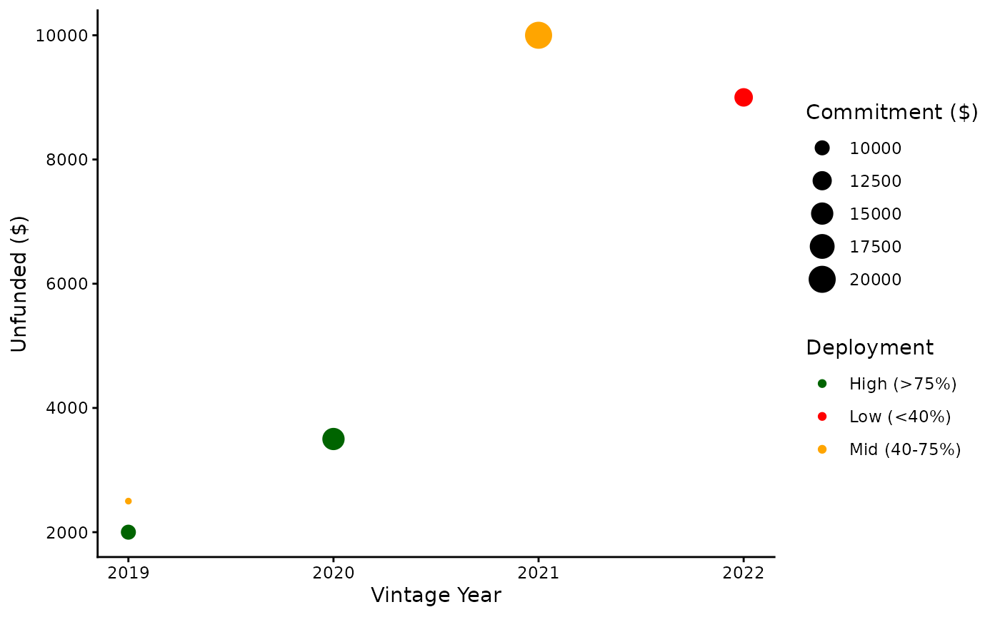

# Introduction to pegap

``` r

library(pegap)
```

## Motivation

RStudio currently does not have extensive packages for PE Portfolio
Analysis. This package aims to bridge a couple of those gaps.

## Dataset

`pegap` contains a pre-built simple dataset to practice with containing
5 fake funds’ information.

``` r

code_script
#>     fund vintage_year commitment called recallable
#> 1 Fund A         2019      10000   9000       1000
#> 2 Fund B         2020      15000  12000        500
#> 3 Fund C         2019       8000   6000        500
#> 4 Fund D         2021      20000  10000          0
#> 5 Fund E         2022      12000   3000          0
```

The dataset contains five variables: - `fund` — name of the fund -
`vintage_year` — year the fund began investing - `commitment` — total
capital committed in USD (\$) - \`called\` — capital called to date in
USD (\$) - `recallable` — recallable distributions in USD (\$)

## Vintage Diversification Score

Quantifies the risk of weighting portfolios to heavily on one year using
the Herfindahl-Hirschman Index (HHI). A score of 100 means perfect
diversification across years.

``` r

vintage_diversification_score(
  fund_names = code_script$fund,
  vintage_years = code_script$vintage_year,
  committed_capital = code_script$commitment
)
#> $vintage_weights
#>  2021  2019  2020  2022 
#> 0.308 0.277 0.231 0.185 
#> 
#> $HHI
#> [1] 0.259
#> 
#> $effective_vintages
#> [1] 3.9
#> 
#> $diversification_score
#> [1] 98.8
#> 
#> $flag
#> [1] "WARNING: High vintage concentration"
```

\*\*Note: when HHI\>0.25, a warning message displays.

## Unfunded Liability Schedule

Forecasts expected capital calls over a 5-year timeline using a
realistic preset deployment curve (Year1-Slow, Year3-Peak) It calculates
each fund’s current unfunded liability
(`commitment - called + recallable`) and distributes it across five
years

``` r

unfunded_liability_schedule(code_script)
#>     fund current_unfunded Year1 Year2 Year3 Year4 Year5
#> 1 Fund A             2000   100   400   700   500   300
#> 2 Fund B             3500   175   700  1225   875   525
#> 3 Fund C             2500   125   500   875   625   375
#> 4 Fund D            10000   500  2000  3500  2500  1500
#> 5 Fund E             9000   450  1800  3150  2250  1350
```

## Portfolio Plot

Provides a visualisation of the portfolio as a scatterplot. Each point
represents a fund, size shows total commitment and colour shows
deployment progress. The x-axis shows vintage year, and the y-axis shows
remaining unfunded commitment.

``` r

portfolio_plot(code_script)
```


